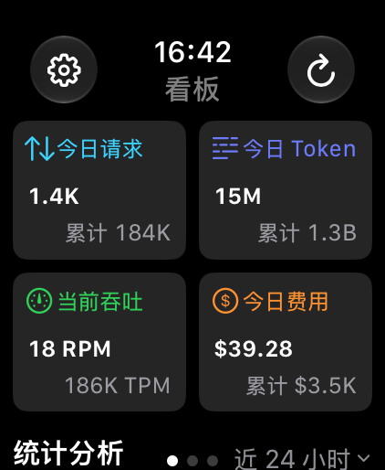
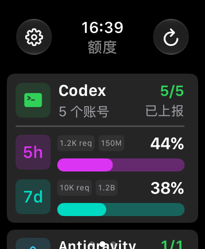
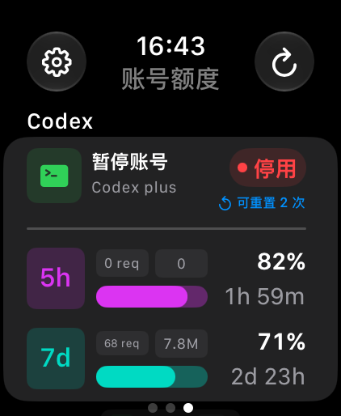
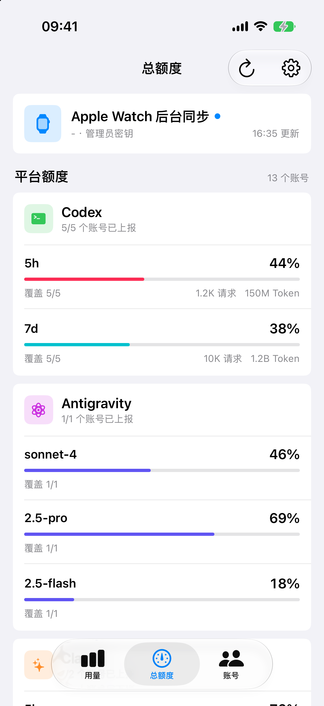
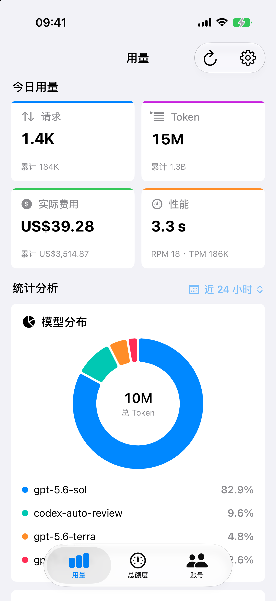

# Sub2Watch

面向个人使用的 AI 账号额度与用量监控工具。iPhone 负责登录和请求 Sub2API，Apple Watch 只接收不含凭据的数据快照，可随时查看额度、请求、Token、费用、模型分布和使用趋势。

> 当前已接入 Codex、Claude、Gemini、Antigravity 和 Grok。不同平台的额度窗口分别统计，不会把含义不同的额度混在一起。

## Apple Watch

Watch 是主要查看入口：左侧看板展示核心用量，中间默认显示各平台总额度，右侧查看单个账号。

<p align="center">
  
  
  
</p>

## iPhone

iPhone 用于登录、配置和完整数据浏览，同时在前台及系统允许的后台时机刷新数据并同步到 Watch。

<p align="center">
  
  
</p>

截图使用 Debug 模拟数据生成，不包含真实服务器地址、账号或密钥。

## 功能

- 使用邮箱密码、2FA 验证码或管理员密钥登录 Sub2API
- 按平台汇总平均剩余额度、数据覆盖数、请求数、Token 和实际费用
- 展示每个账号的平台额度窗口、重置时间、请求、Token 和账号状态
- 展示今日及累计请求、输入/输出/缓存 Token、费用、RPM、TPM 和平均响应时间
- 按今天、昨天、近 24 小时、近 7 天、近 30 天、本月和上月查看模型分布与 Token 趋势
- 在 Sub2API Ops Monitoring 可用时展示 OpenAI 模型请求、输出 Token、生成速度和首 Token 延迟
- 支持账号列表刷新和单账号实时额度刷新
- Watch 支持看板、总额度、账号额度、表盘复杂功能和智能叠放
- 当额度较上次增加、达到 90% 以上且变化超过 0.5% 时发送额度重置通知
- 本地缓存最近一次快照，暂时离线时仍可查看并标记数据更新时间

## 数据与隐私

- 登录凭据只保存在 iPhone Keychain，配置为仅本设备、解锁后可用。
- 所有 Sub2API 请求由 iPhone 发起，Watch 不再直接连接服务器。
- iPhone 通过 WatchConnectivity 同步账号、额度、请求、Token、费用、模型分布和趋势快照。
- 快照不包含服务器地址、密码、管理员密钥、access token 或 refresh token。
- Watch 刷新按钮会请求 iPhone 更新；iPhone 暂不可达时，系统会保留请求并在连接恢复后处理。
- iPhone 前台每分钟刷新；返回前台且数据超过 2 分钟时立即刷新。
- 后台任务会申请最早 5 分钟后刷新，但实际执行时间由 iOS 决定，系统不保证固定间隔。

## 系统要求

- Xcode 16 或更高版本
- iPhone 运行 iOS 17 或更高版本
- Apple Watch 运行 watchOS 10 或更高版本
- 一个可从 iPhone 当前网络访问的 Sub2API 地址
- Sub2API 登录账号或管理员密钥

项目当前已在 Xcode 27、iOS 27 和 watchOS 27 Beta 环境验证。建议为 Sub2API 配置可信 HTTPS 证书；允许 HTTP 只会放宽明文连接限制，不会让自签名或无效的 HTTPS 证书变得可信。

## 个人真机安装

1. 用 Xcode 打开 `Sub2Watch.xcodeproj`。
2. 在 `Sub2Watch`、`Sub2Watch Watch App` 和 `Sub2WatchWidgetsExtension` 三个 Target 的 **Signing & Capabilities** 中选择自己的 Personal Team。
3. 如果默认 Bundle ID 已被占用，将 `com.yinian.Sub2Watch` 改为自己的唯一 ID，并让 Watch App 和 Widget Extension 的 ID 保持为它的子级。
4. 在 iPhone 和 Apple Watch 上启用开发者模式，并确保手表已与该 iPhone 配对。
5. 选择 `Sub2Watch` Scheme 和已连接的 iPhone，点击 Run。iOS App 已嵌入 Watch App；如果没有自动安装，可在 iPhone 的 Watch App 中安装 Sub2Watch。
6. 在 iPhone 打开 Sub2Watch，输入服务地址并登录。需要 2FA 时继续输入 6 位验证码。
7. 登录并刷新后打开 Watch App，确认最近同步时间和额度数据。

watchOS/Xcode 27 Beta 如需单独覆盖安装 Watch App，可使用 [`DEPLOYMENT.md`](DEPLOYMENT.md) 中的“仅安装、不调试”脚本。该文档也记录了已验证的真机环境、连接异常和网络恢复经验，重新安装或修改网络层前请先阅读。

使用免费 Personal Team 安装的应用通常需要定期重新签名；个人自用不需要 App Store Connect 或 TestFlight。

## 网络与同步

- 公网部署推荐使用 iPhone 能解析并访问、带可信证书的 HTTPS 域名。
- 局域网部署时，iPhone 必须能访问对应 IP 和端口；蜂窝网络访问私网地址则需要 VPN、隧道或公开入口。
- Watch 只需要与配对 iPhone 建立系统同步链路，不需要直接访问 Sub2API。
- iPhone 和 Watch 不必始终同时打开。最新 application context 会由系统保留，并在链路可用时送达。
- 管理员密钥模式通过 `x-api-key` 请求头调用 Sub2API 的只读管理接口。

主要接口：

- `GET /api/v1/admin/accounts`
- `GET /api/v1/admin/accounts/:id/usage`
- `GET /api/v1/admin/openai/accounts/:id/quota`
- `GET /api/v1/admin/usage`
- `GET /api/v1/admin/usage/stats`
- `GET /api/v1/admin/dashboard/stats`
- `GET /api/v1/admin/ops/dashboard/openai-token-stats`

首页刷新会以最多 2 个账号并发刷新额度。Codex 保留专用额度接口以及本地 5h/服务端 7d 用量统计；其他平台使用 Sub2API 通用账号 usage 接口，并保留各平台自己的窗口定义。每个平台、每种窗口独立计算平均剩余和数据覆盖数。用量页的今日与累计数据是全站口径，可能包含非 OpenAI 请求；模型统计才是 OpenAI 口径，且需要 Sub2API 开启 Ops Monitoring。

## 开发与测试

Debug 构建支持以下启动环境变量：

- `SUB2WATCH_DEMO=1`：iPhone 或 Watch 跳过配置页并加载模拟数据
- `SUB2WATCH_PAGE=0|1|2`：Watch 直接打开看板、总额度或账号额度页，默认值为 `1`
- `SUB2WATCH_PHONE_TAB=usage|quota|accounts`：iPhone 直接打开用量、总额度或账号页
- `SUB2WATCH_BASE_URL`、`SUB2WATCH_ADMIN_KEY`：仅用于 Watch 直连兼容和诊断；日常配置请在 iPhone 输入

Watch 配置页的“开发 > 查看模拟数据”也可以进入模拟模式。这些入口只存在于 Debug 构建。联合模拟器测试时，在 iPhone Scheme 设置 `SUB2WATCH_DEMO=1`，iPhone 会将模拟快照同步到配对 Watch。

运行核心逻辑测试：

```bash
SWIFTPM_MODULECACHE_OVERRIDE=/tmp/sub2watch-swift-cache \
CLANG_MODULE_CACHE_PATH=/tmp/sub2watch-clang-cache \
swift test --disable-sandbox --scratch-path /tmp/sub2watch-build
```

运行无签名 watchOS 真机目标构建：

```bash
xcodebuild -project Sub2Watch.xcodeproj \
  -scheme "Sub2Watch Watch App" \
  -configuration Debug \
  -destination "generic/platform=watchOS" \
  -derivedDataPath /tmp/Sub2WatchDerivedData \
  CODE_SIGNING_ALLOWED=NO build
```
